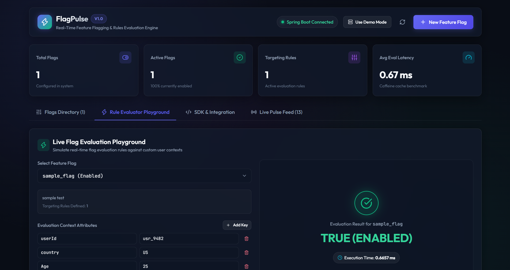
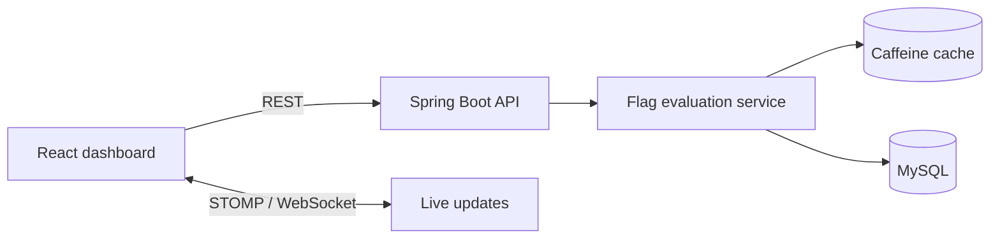
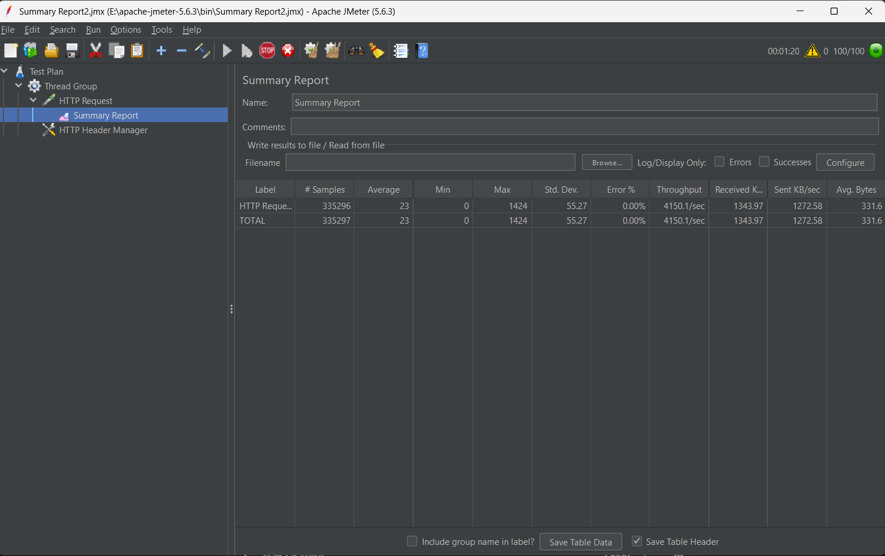

# FlagPulse

### Real-time feature flags, targeting rules, and rollout control

FlagPulse is a backend-first feature flag platform built with Spring Boot and React. It gives teams a small control plane for creating flags, evaluating user context against targeting rules, and broadcasting runtime changes to connected clients.



## Why it matters

Feature flags let teams release code safely, run targeted rollouts, and turn functionality on or off without redeploying. FlagPulse models that workflow with a REST API, a cached evaluation service, and real-time WebSocket updates.

## Highlights

- REST endpoints for flag creation, listing, toggling, and evaluation
- Targeting operators for equality, numeric comparison, and percentage rollout
- Caffeine caching with cache invalidation after flag changes
- STOMP over WebSocket broadcasts for live client updates
- React dashboard with flag directory, rule playground, activity feed, and SDK snippets
- Demo mode for offline product exploration
- Environment-based configuration with credentials excluded from source control

## Architecture



## Performance evidence

The included JMeter run demonstrates high-throughput API traffic with zero recorded errors in the captured test report.



## Tech stack

| Area | Technologies |
| --- | --- |
| Backend | Java, Spring Boot, Spring Data JPA, MySQL |
| Runtime | Caffeine, STOMP, WebSocket, SockJS |
| Frontend | React, Vite, Tailwind CSS, Lucide |
| Testing | JUnit, JMeter |

## Project structure

```text
FlagPulse/
	src/main/java/       REST API, services, models, repositories, WebSocket config
	src/main/resources/  Spring configuration
flagpulse-frontend/
	src/components/      Dashboard views and workflows
	src/services/        REST and WebSocket clients
docs/images/            Product and performance screenshots
```

## Run locally

### Backend

Create a MySQL database, then provide credentials through your local environment:

```powershell
$env:DB_USERNAME="your_database_username"
$env:DB_PASSWORD="your_database_password"
cd FlagPulse
.\mvnw.cmd spring-boot:run
```

The API runs at `http://localhost:8083` by default. See `FlagPulse/src/main/resources/application-local.properties.example` for the local configuration shape.

### Frontend

```powershell
cd flagpulse-frontend
Copy-Item .env.example .env.local
npm install
npm run dev
```

Set `VITE_API_BASE_URL` and `VITE_WEBSOCKET_URL` in `.env.local` when your backend uses different endpoints. The dashboard falls back to Demo Mode when the API is unavailable.

## API example

```http
POST /api/v1/flags/evaluate
Content-Type: application/json

{
	"flagKey": "new-checkout-flow",
	"context": {
		"userId": "usr_9482",
		"country": "US",
		"userAge": 24
	}
}
```

## Security

Never commit passwords, API keys, access tokens, or production configuration. Local `.env` files and Spring local configuration are ignored by Git. The repository includes only safe example configuration files.

## Validation

```powershell
cd flagpulse-frontend
npm run lint
npm run build
```

## License

This project is provided for portfolio and educational use.
